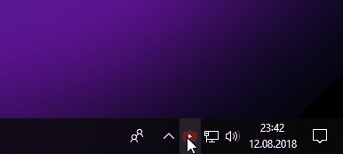

    

# Clipboard to youtube-dl

This Go application will monitor your clipboard for urls and automatically starts download with [youtube-dl](https://github.com/rg3/youtube-dl/) ([list of supported sites](https://github.com/rg3/youtube-dl/blob/master/docs/supportedsites.md)). 
After download has been finished you'll get a system notification with detailed information. In your system tray you'll find a new icon to control this application.

## Features

* queue copied urls
* start and stop download
* push notifications
* configure different profiles

**IMPORTANT**

Currently I can only support running this app under Windows and Linux.
 
## Configuration

This is a sample configuration file `config.yml`.

    profile:
      playlist:
        title: Playlist
        args:
          - -o
          - '~/Videos/%(playlist)s/%(playlist_index)s - %(title)s.%(ext)s'
      video_temp:
        title: Video (temp)
        args:
          - -o
          - '/tmp/Videos/%(title)s.%(ext)s'
      music:
        title: Music
        args:
          - -o
          - '~/Musik/%(title)s.%(ext)s'
          - --audio-quality
          - 0
          - --audio-format
          - mp3
          - -x
          - --add-metadata
          - --metadata-from-title
          - '%(artist)s - %(title)s'

    default:
      profile: music

You can use all options of [youtube-dl](https://github.com/rg3/youtube-dl/) like video or audio format, quality, output directory and pass them as `args` inside of a profile.

## Building from sources

### Requirements

* [Go](https://golang.org/doc/install) including [dep](https://github.com/golang/dep)
* [youtube-dl](https://github.com/rg3/youtube-dl/)
* [Docker CE](https://docs.docker.com/install/linux/docker-ce/ubuntu/#install-docker-ce)

First you need to create a new folder under your ``$GOPATH``.

    $ mkdir -p $GOPATH/src/github.com/hebestreit

Navigate in this folder and checkout this repository.

    $ cd $GOPATH/src/github.com/hebestreit
    $ git clone https://github.com/hebestreit/clipboard-yt-dl.git

For this part you'll need Docker to build application for all platforms. See below how to compile without docker.

    $ cd clipboard-yt-dl
    $ make all

Of course you can build it without Docker directly on your system. Be sure you've all required dev packages installed.

    $ GOOS=linux CC=clang CXX=clang++ go build -o "bin/clipboard-yt-dl_linux" ./cmd/clipboard-yt-dl $*
    $ GOOS=windows CC=x86_64-w64-mingw32-gcc CXX=x86_64-w64-mingw32-g++ go build -o "bin/clipboard-yt-dl_windows.exe" -ldflags "-H=windowsgui -extldflags=-s" ./cmd/clipboard-yt-dl $*
    $ darwin CGO_LDFLAGS_ALLOW="-mmacosx-version-min.*" CC=o64-clang CXX=o64-clang++ go build -o "bin/clipboard-yt-dl_darwin.app" ./cmd/clipboard-yt-dl $*

Now you can find all binaries under ``$GOPATH/src/github.com/hebestreit/clipboard-yt-dl/bin`` and start copying over the world!

    $ ls -l bin/
    clipboard-yt-dl_darwin.app
    clipboard-yt-dl_linux
    clipboard-yt-dl_windows.exe

## Trouble Shooting

### extractor: youtube-dl is not in PATH

This error occurs if you have not installed ``youtube-dl`` correctly and set location to your environment variables. Under Linux you can simply move to ``/usr/local/bin/youtube-dl``.
For Windows check this answer on [stackoverflow.com](https://stackoverflow.com/a/41895179) and restart your system. ;-)

# Dependencies

This is a list of dependencies I'm using in this project.

* [github.com/shivylp/clipboard](https://github.com/shivylp/clipboard) for monitoring clipboard which is a fork of [github.com/atotto/clipboard](https://github.com/atotto/clipboard).
* [github.com/gen2brain/beeep](https://github.com/gen2brain/beeep) sending notifications
* [github.com/getlantern/systray](https://github.com/getlantern/systray) menu item in systray for user interactions